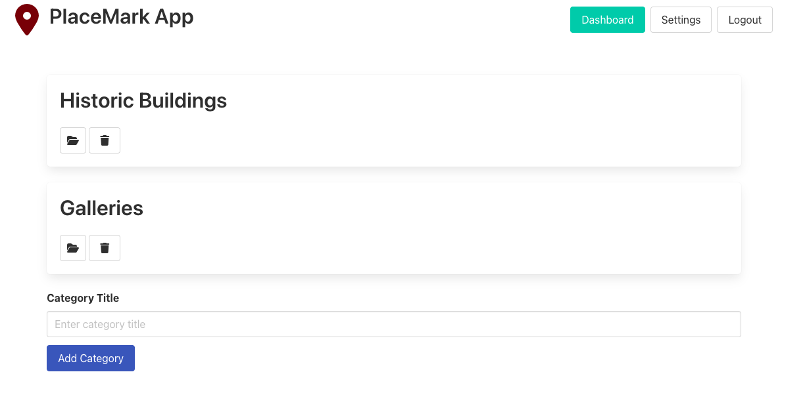
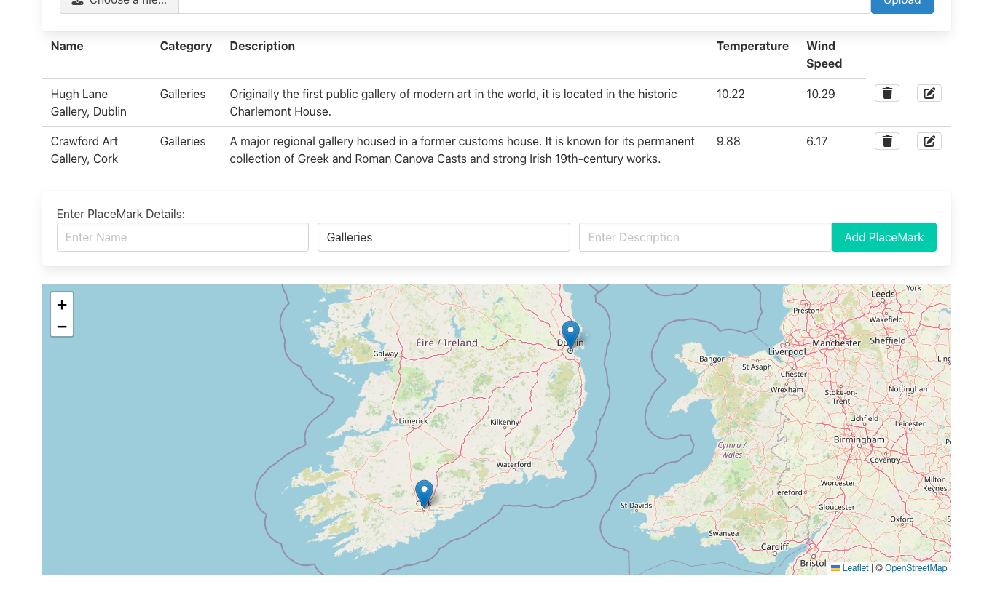
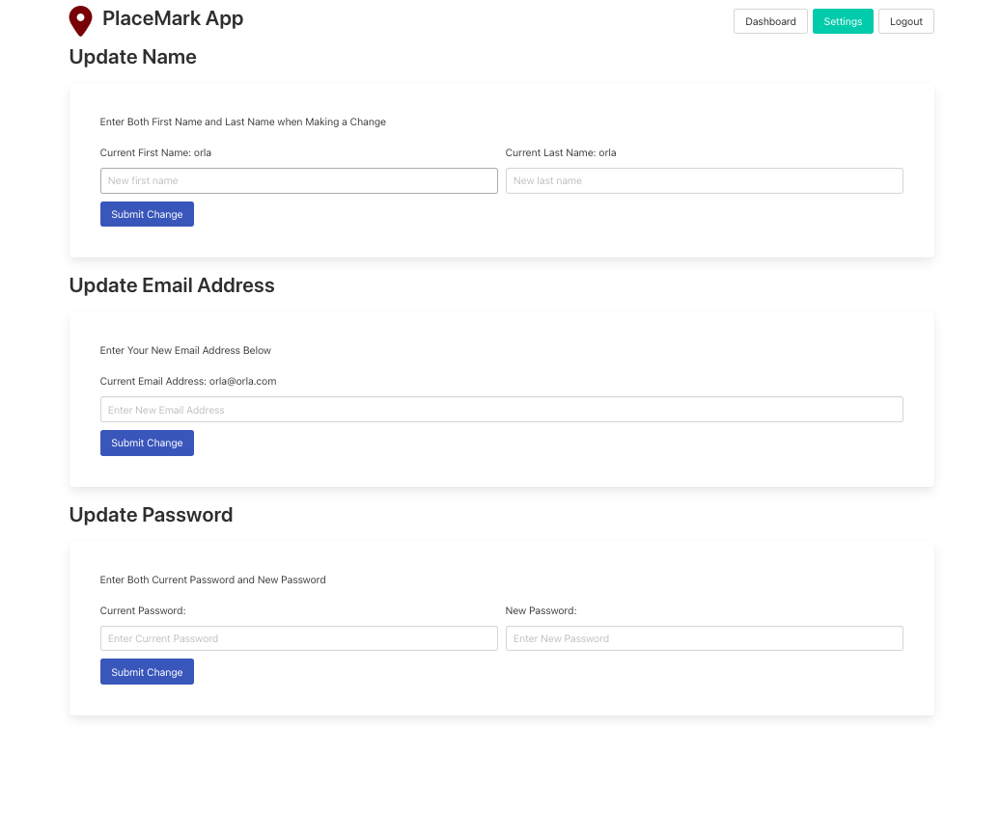
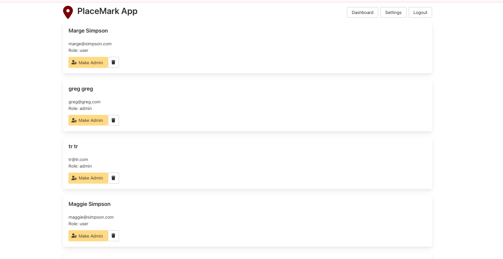
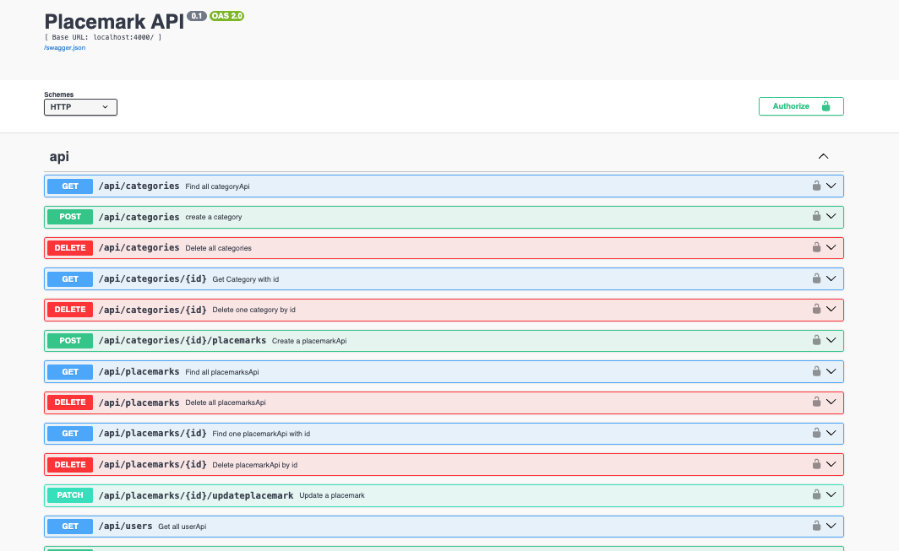

### Title:

Irish Landmark Application



### Description:



This web service allows users to create Categories of landmarks in Ireland and add examples of those categories as Placemarks.


Users can upload a picture for each placemark, which is displayed on the main category page. Once a placemark is added, the app shows its location on a map along with the current weather at that location. Users can scroll down to see their favorite places visualized with placemarks on an interactive map.



Users can also update their name, email and password in the website's settings page.

### Developer:
The backend API is intended for developers to manage Users, Categories, and Placemarks. It includes endpoints for CRUD operations, JWT authentication, and can be run locally with memory, JSON, MongoDB, or Firestore databases.

### Usage:

Sign up and log into the website using your email address and password. Create your chosen category. Add a name with the city and a description. you'll then see the weather for that location. Scroll down to see placemarks on a map, and scroll up to add an image for the category.

User details can be updated from the Settings page. The user can update their first name, last name, password or email address.
You can access the dashboard, settings, or log out of your account from the menu bar at the top of the screen.

## Examples:

### Multiple Memory Stores:

Memory Stores are connected via a db facade object so that they can be used seperately in production.

```js

export const db = {
  userStore: null,
  categoryStore: null,
  placemarkStore: null,

    init(storeType) {
    switch (storeType) {
      case "json" :
        this.userStore = userJsonStore;
        this.placemarkStore = placemarkJsonStore;
        this.categoryStore = categoryJsonStore;
        break;
      case "mongo" :
        this.userStore = userMongoStore;
        this.categoryStore = categoryMongoStore;
        this.placemarkStore = placemarkMongoStore;
        connectMongo();
        break;
       case "firebase" :
         this.userStore = userFirebaseStore;
         this.categoryStore = categoryFirebaseStore;
         this.placemarkStore = placemarkFirebaseStore;
        break;
      default :
       this.userStore = userMemStore;
       this.categoryStore = categoryMemStore;
       this.placemarkStore = placemarkMemStore;
  }

```
#### Mem-Store:

A simple in-memory store for development and testing; all data is lost when the server restarts.

```js

export const userMemStore = {
  async getAllUsers() {
    return users;
  },

  async addUser(user) {
    user._id = v4();
    users.push(user);
    return user;
  },

  async getUserById(id) {
    let u = users.find((user) => user._id === id);
    if(u === undefined){u = null};
    return u;
  },

  async getUserByEmail(email) {
    let u = users.find((user) => user.email === email);
    if(u === undefined){u = null};
    return u;
  },

  async updateUserName(userid, updates){
   
    // check that both firstname and last name have been added
     if (!updates.firstName || !updates.lastName) {
    throw new Error("Both first and last name required");
}

    const foundUser = users.find((u) => u._id === userid);

    if (foundUser) {
   // Merge target with the source
    Object.assign(foundUser, updates);

    return foundUser;
    }
    return null;
  },
}

```

#### JSON-Store:

Stores data persistently in local JSON files. Good for lightweight development.


```js


import { v4 } from "uuid";
import { db } from "./store-utils.js";
import { placemarkJsonStore } from "./placemark-json-store.js";

export const categoryJsonStore = {
  async getAllCategories() {
    await db.read();
    return db.data.categories;
  },

  async addCategory(category) {
    await db.read();
    category._id = v4();
    db.data.categories.push(category);
    await db.write();
    return category;
  },

  async getCategoryById(id) {
    await db.read();
    const list = db.data.categories.find((category) => category._id === id);
    if(list){
    list.placemarks = await placemarkJsonStore.getPlacemarksByCategoryId(list._id);
    return list;}
    return null;
  },

  async getUserCategories(userid) {
    await db.read();
    return db.data.categories.filter((category) => category.userid === userid);
  },

  ```


#### Mongo-Store:

Uses MongoDB (Atlas or local) as a document-based database for storing users, categories, and placemarks.

Connects to MongoDB using Mongoose, initializes schemas, and seeds the database with sample data for development or testing.

```js

import Mongoose from "mongoose";

const { Schema } = Mongoose;

const categorySchema = new Schema({
  title: String,
  img: String,
  userid: {
    type: Schema.Types.ObjectId,
    ref: "User",
  },
});

export const Category = Mongoose.model("Category", categorySchema);


```


```js

const seedLib = mongooseSeeder.default;

async function seed() {
  const seeder = seedLib(Mongoose);
  // updated to false to persist data in monggoDB
  const dbData = await seeder.seed(seedData, { dropDatabase: false, dropCollections: false });
  console.log(dbData);
}

export function connectMongo() {
  dotenv.config();

  Mongoose.set("strictQuery", true);
  Mongoose.connect(process.env.db);
  const db = Mongoose.connection;

```

#### Firebase-Store:

Initializes Firestore using Firebase Admin with credentials from environment variables, and provides collections for users, categories, and placemarks without requiring predefined schemas.


```js
mport dotenv from "dotenv";

import admin from "firebase-admin";

dotenv.config();


// replace back spaces in env with actual newline characters
const privateKey = process.env.firebase_private_key.replace(/\\n/g, '\n');

try {
    // Initialize Firebase Admin with Application Default Credentials - env variable set in terminal
  admin.initializeApp({
  credential: admin.credential.cert({
  type: process.env.firebase_type,
  project_id: process.env.firebase_project_id,
  private_key: privateKey,
  client_email: process.env.firebase_client_email,
    }),
  }); 
  console.log("Firebase initialized");
} catch (err) {
  console.error("Firebase failed:", err);
}

export const firestore = admin.firestore();

```

Stores placemarks in Firestore with a created timestamp to allow queries ordered by creation time, and automatically generates document IDs when adding new entries.

```js

 async getPlacemarksByCategoryId(categoryid) {
  // order by timestamp when multiple objects being returned - ordered
   const snapshot = await placemarkCollection.where("categoryid", "==", categoryid).orderBy("created").get();
   if(snapshot.empty)return[];
   const placemarks = snapshot.docs.map(doc => ({ _id: doc.id, ...doc.data() }));

   return placemarks;
  },

 async addPlacemark(categoryid, placemark) {
    try {
    // remove id if it exists
    const { _id, ...cleanPlacemark } = placemark;

    if (!categoryid) throw new Error("Cannot add placemark without a categoryid");
    // merge categoryid with placemark
    const placemarkData = {...cleanPlacemark, categoryid: categoryid, created: Date.now()};  
    const docRef = await placemarkCollection.add(placemarkData);
    console.log("Placemark created with ID: ", docRef.id);
    return { _id: docRef.id, ...placemarkData };
    
  } catch (error) {
    console.error("Error creating placemark: ", error);
     throw error;
  }

},

```


### Admin Dashboard




A cookie is issued a log in that issues the user with a scope. User scope by default.

The handler runs when the route is accessed, and auth enforces the session strategy and requires the admin scope before Hapi calls the handler.


```js
  { method: "GET", path: "/dashboard/admin", config: { auth: { strategy: "session", scope: "admin" }, handler: dashboardController.adminIndex.handler } },
  { method: "POST", path: "/dashboard/makeadmin/{id}", config: { auth: { strategy: "session", scope: "admin" }, handler: dashboardController.makeAdmin.handler } },
  { method: "GET", path: "/dashboard/deleteuser/{id}", config: { auth: { strategy: "session", scope: "admin" }, handler: dashboardController.deleteUser.handler } },

```

All users are sent to the dashboard. Users with scope property of admin are redirected to the adminIndex:

```js
     // if user is admin - redirect admin dashboard
      if (loggedInUser.scope === "admin") {
      return h.redirect("/dashboard/admin");
    }

```


User analytics include deleting a user and setting a user as an admin.

```js
async setAdmin(id) {
  const userRef = userCollection.doc(id);

  // set scope as a string
  await userRef.update({ scope: "admin" });

  const updatedDoc = await userRef.get();
  return { _id: updatedDoc.id, ...updatedDoc.data() };
},

```

### External Api Calls:


These functions use Axios to call external APIs. getPlacemarkCoordinates sends a request to the Geoapify geocoding API to get latitude and longitude for a placemark in Ireland. getWeatherFromCoordinates uses those coordinates to fetch current weather data from OpenWeatherMap. Both functions return structured data (coordinates or weather) and handle basic errors like missing data or failed requests.

#####Example of api call getPlacemarkCoordinates():

```js

try{
const url = `https://api.geoapify.com/v1/geocode/search?text=${properName}&limit=1&apiKey=${key}&country=ireland`
const result = await axios.get(url);

if(result.status === 200){
    const geoData = result.data;

    if(geoData.features && geoData.features.length > 0){
        const [lon, lat] = geoData.features[0].geometry.coordinates;
        coords = {lat, lon};

       
    }
   
}

```


### Backend Api:


This function creates a JWT token for a user, which is used to authenticate API requests.

```js

export function createToken(user) {
  const payload = {
    id: user._id,
    email: user.email,
  };
  const options = {
    algorithm: "HS256",
    expiresIn: "1h",
  };
  return jwt.sign(payload, process.env.cookie_password, options);
}

```

These are examples of API routes for updating a user’s password and deleting all users, showing how the backend exposes CRUD functionality that can be accessed by clients or other services.

```js
  { method: "PATCH", path: "/api/users/{id}/password", config: userApi.updatePassword },
  { method: "DELETE", path: "/api/users", config: userApi.deleteAll },

  ```


  This route handles updating a user’s email and includes validation of parameters and payload, defines the expected response format, and uses tags to categorize the endpoint in the API documentation.

  ```js

 updateUserEmail: {
       auth: { strategy: "jwt" },
       handler: async function(request, h) {
       const { id } = request.params;
       const email = request.payload; // patial update - can be any field for api
       try {
         const updatedUser = await db.userStore.updateUserEmail(id, email);
         if (!updatedUser) return Boom.notFound("User not found");
          return updatedUser;
          } catch (err) {
           return Boom.serverUnavailable("Database error");
         }
       },
        tags: ["api"],
       description: "Update user email",
       notes: "Update email field of user",
       validate: { 
       params: { id: IdSpec },
       // payload is just the first and last name
       payload: UserSpecEmail, failAction: validationError }, // allow partial updates
      // respose is the full user spec
      response: { schema: UserSpecPlus, failAction: validationError },
      },

  ```

These Joi schemas define the structure and validation rules for user data, ensuring that API requests receive correctly formatted inputs.

  ```js
  export const UserCredentialsSpec = Joi.object()
 .keys({
    email: Joi.string().email().example("homer@simpson.com").required(),
    password: Joi.string().example("secret").required(),
})
.label("UserCredentials");

// User Spec for Updating First and last Name
export const UserSpecName = Joi.object().keys({
    firstName: Joi.string().example("Homer").optional(),
    lastName: Joi.string().example("Simpson").optional(),
   
  })

   ```


This Swagger interface shows the available API endpoints for Users, Categories, and Placemarks. It can be used developers to test the API locally while the server is running.


   


### Tests:

The Test suite includes both Model and Api Tests. All tests use Mocha and Chai.

### Model Tests (in-memory, JSON, Firestore, MongoDB):

#### Model tests ensure that all data stores behave consistently, making the backend interchangeable between memory, JSON, MongoDB, and Firestore.


Create, get, update, and delete users, categories, and placemarks. They rely on fixtures for consistent sample data (maggie, river, liffey, etc.).

Ensures placemarks are correctly associated with categories.

Tests edge cases like fetching non-existent IDs.


  ```js

test("create category with placemarks", async () => {
  const category = await placemarkService.createCategory(river);
  const placemark = await placemarkService.createPlacemark(category._id, liffey);
  assertSubset(liffey, placemark);
});

test("update placemark", async () => {
  const placemark = await placemarkService.createPlacemark(category._id, liffey);
  const updates = { name: "The Dargle", description: "It's in Wicklow" };
  await placemarkService.updatePlacemark(placemark._id, updates);
  const updatedPlacemark = await placemarkService.getPlacemark(placemark._id);
  assertSubset(updates, updatedPlacemark);
});

   ```


These verify CRUD operations for users and ensure proper validation.

```js

 test("update user email", async () => {
  const user = await placemarkService.createUser(testUsers[0]);
  const updatedEmail = { email: "new@email.com" };
  const returnedUser = await placemarkService.updateUserEmail(user._id, updatedEmail);
  assert.strictEqual(returnedUser.email, updatedEmail.email);
});

test("delete all users", async () => {
  await placemarkService.deleteAllUsers();
  const users = await placemarkService.getAllUsers();
  assert.equal(users.length, 0);
});
```

### API Tests


Authentication tests ensure that users can log in, receive a JWT token, and access protected routes.

```js

test("authenticate user", async () => {
  const returnedUser = await placemarkService.createUser(maggie);
  const response = await placemarkService.authenticate({ email: maggie.email, password: maggie.password });
  assert(response.success);
  assert.isDefined(response.token);
});

test("verify token", async () => {
  const response = await placemarkService.authenticate({ email: maggie.email, password: maggie.password });
  const userInfo = decodeToken(response.token);
  assert.equal(userInfo.email, maggie.email);
});

 ```

These tests check the API by sending HTTP requests to the backend and verifying responses, headers, and authentication. They complement the model tests by confirming the API handles requests and enforces security correctly.


```js

  test("delete a category", async () => {
    const category = await placemarkService.createCategory(river);
    const response = await placemarkService.deleteCategory(category._id);
    assert.equal(response.status, 204);
    try {
      const returnedCategory = await placemarkService.getCategory(category.id);
      assert.fail("Should not return a response");
    } catch (error) {
      assert(error.response.data.message.startsWith("No Category with this id"), "Incorrect Response Message");
    }
  });

  test("create multiple categories", async () => {
     for (let i = 0; i < testCategories.length; i += 1) {
      testCategories[i].userid = user._id;
      // eslint-disable-next-line no-await-in-loop
      await placemarkService.createCategory(testCategories[i]);
    }
    let returnedLists = await placemarkService.getAllCategories();
    assert.equal(returnedLists.length, testCategories.length);
    await placemarkService.deleteAllCategories();
    returnedLists = await placemarkService.getAllCategories();
    assert.equal(returnedLists.length, 0);
  });

```

#### Running Tests:

Api tests: npm run api-test

Model tests: npm run mem-test

#### Installation:

Github Repo: https://github.com/oohlah/full_stack_one#

Installation Command: npm install


#### References:

Geoapi docs and api swagger testing: https://apidocs.geoapify.com/docs/geocoding/

used webdev2 assigment as reference for axios: https://github.com/oohlah/web-dev-2-assignment

quick start for leaflet - linking ccs and src link: https://leafletjs.com/examples/quick-start/

basic street map and coordinates: https://github.com/oohlah/web-dev-2-assignment/blob/main/views/partials/station-map.hbs

assistance with initialising firebase-admin/server backend set up: https://firebase.google.com/docs/firestore/quickstart-server#node.js

crud operations firebase: https://medium.com/@ujwalbholan/setting-up-firebase-admin-sdk-in-a-node-js-backend-with-full-crud-operations-43325c99ef50

more crud operations firebase https://habtesoft.medium.com/building-a-robust-backend-crud-with-cloud-firestore-and-node-js-7919e5644c7f 

how to batch delete all documents from collection in firestore: https://github.com/googleapis/nodejs-firestore/issues/64 

Get multiple documents using where query and check if empty https://firebase.google.com/docs/firestore/query-data/get-data


print error to verify firebase is connected: https://firebase.google.com/docs/database/web/offline-capabilities#detect_connection_state

use of .replace to initialise private key for firebase https://stackoverflow.com/questions/50299329/node-js-firebase-service-account-private-key-wont-parse

orderBy method solution to placemarks returned in the wrong order https://firebase.google.com/docs/firestore/query-data/order-limit-data


merging with an existing object in javascript - Object.assign: https://developer.mozilla.org/en-US/docs/Web/JavaScript/Reference/Global_Objects/Object/assign

adapted patch route for user-api https://doc.castsoftware.com/technologies/web/nodejs/com.castsoftware.nodejs/2.14/results/hapi/


parital updates in firestore https://rajatamil.medium.com/how-to-partially-update-a-document-in-cloud-firestore-9b3315ebdca3


ref for partial update of json file https://developer.mozilla.org/en-US/docs/Web/JavaScript/Reference/Global_Objects/Object/assign

isTrue assertion in chai for returned boolean values: https://www.chaijs.com/api/assert/#method_istrue

admin priveleges via cookie https://dev.to/imsushant12/mastering-web-development-cookies-authorization-authentication-and-file-uploads-in-nodejs-52j3

Admin authentication with hapi - scopes: https://futurestud.io/tutorials/hapi-restrict-user-access-with-scopes

using scope with jwt hapi https://auth0.com/blog/hapijs-authentication-secure-your-api-with-json-web-tokens/#Authenticating-Users
